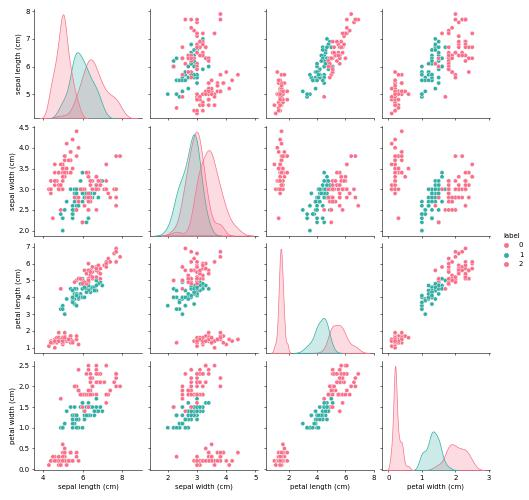

# 의사결정나무를 사용한 붓꽃 데이터 분류하기

의사결정나무(Decision Tree)를 이용하여 sklearn에서 제공하는 붓꽃 데이터를 분류해보도록 하겠습니다.

## 1. 패키지 및 데이터 불러오기


```python
import numpy as np
import pandas as pd
import seaborn as sns
import warnings
warnings.filterwarnings('ignore')
from sklearn.datasets import load_iris
from sklearn.tree import DecisionTreeClassifier
from sklearn.model_selection import train_test_split
from sklearn.tree import export_graphviz
from sklearn.tree import plot_tree 
from IPython.display import Image
```


```python
# 데이터 담아주기
iris = load_iris()
iris.feature_names
```


    ['sepal length (cm)',
     'sepal width (cm)',
     'petal length (cm)',
     'petal width (cm)']


```python
#데이터 확인하기
iris.data
```


    array([[5.1, 3.5, 1.4, 0.2],
           [4.9, 3. , 1.4, 0.2],
           [4.7, 3.2, 1.3, 0.2],
           [4.6, 3.1, 1.5, 0.2],
           [5. , 3.6, 1.4, 0.2],
           [5.4, 3.9, 1.7, 0.4],
           [4.6, 3.4, 1.4, 0.3],
           [5. , 3.4, 1.5, 0.2],
           [4.4, 2.9, 1.4, 0.2],
           [4.9, 3.1, 1.5, 0.1],
           [5.4, 3.7, 1.5, 0.2],
           [4.8, 3.4, 1.6, 0.2],
           [4.8, 3. , 1.4, 0.1],
           [4.3, 3. , 1.1, 0.1],
           [5.8, 4. , 1.2, 0.2],
           [5.7, 4.4, 1.5, 0.4],
           [5.4, 3.9, 1.3, 0.4],
           [5.1, 3.5, 1.4, 0.3],
           [5.7, 3.8, 1.7, 0.3],
           [5.1, 3.8, 1.5, 0.3],
           [5.4, 3.4, 1.7, 0.2],
           [5.1, 3.7, 1.5, 0.4],
           [4.6, 3.6, 1. , 0.2],
           [5.1, 3.3, 1.7, 0.5],
           [4.8, 3.4, 1.9, 0.2],
           [5. , 3. , 1.6, 0.2],
           [5. , 3.4, 1.6, 0.4],
           [5.2, 3.5, 1.5, 0.2],
           [5.2, 3.4, 1.4, 0.2],
           [4.7, 3.2, 1.6, 0.2],
           [4.8, 3.1, 1.6, 0.2],
           [5.4, 3.4, 1.5, 0.4],
           [5.2, 4.1, 1.5, 0.1],
           [5.5, 4.2, 1.4, 0.2],
           [4.9, 3.1, 1.5, 0.2],
           [5. , 3.2, 1.2, 0.2],
           [5.5, 3.5, 1.3, 0.2],
           [4.9, 3.6, 1.4, 0.1],
           [4.4, 3. , 1.3, 0.2],
           [5.1, 3.4, 1.5, 0.2],
           [5. , 3.5, 1.3, 0.3],
           [4.5, 2.3, 1.3, 0.3],
           [4.4, 3.2, 1.3, 0.2],
           [5. , 3.5, 1.6, 0.6],
           [5.1, 3.8, 1.9, 0.4],
           [4.8, 3. , 1.4, 0.3],
           [5.1, 3.8, 1.6, 0.2],
           [4.6, 3.2, 1.4, 0.2],
           [5.3, 3.7, 1.5, 0.2],
           [5. , 3.3, 1.4, 0.2],
           [7. , 3.2, 4.7, 1.4],
           [6.4, 3.2, 4.5, 1.5],
           [6.9, 3.1, 4.9, 1.5],
           [5.5, 2.3, 4. , 1.3],
           [6.5, 2.8, 4.6, 1.5],
           [5.7, 2.8, 4.5, 1.3],
           [6.3, 3.3, 4.7, 1.6],
           [4.9, 2.4, 3.3, 1. ],
           [6.6, 2.9, 4.6, 1.3],
           [5.2, 2.7, 3.9, 1.4],
           [5. , 2. , 3.5, 1. ],
           [5.9, 3. , 4.2, 1.5],
           [6. , 2.2, 4. , 1. ],
           [6.1, 2.9, 4.7, 1.4],
           [5.6, 2.9, 3.6, 1.3],
           [6.7, 3.1, 4.4, 1.4],
           [5.6, 3. , 4.5, 1.5],
           [5.8, 2.7, 4.1, 1. ],
           [6.2, 2.2, 4.5, 1.5],
           [5.6, 2.5, 3.9, 1.1],
           [5.9, 3.2, 4.8, 1.8],
           [6.1, 2.8, 4. , 1.3],
           [6.3, 2.5, 4.9, 1.5],
           [6.1, 2.8, 4.7, 1.2],
           [6.4, 2.9, 4.3, 1.3],
           [6.6, 3. , 4.4, 1.4],
           [6.8, 2.8, 4.8, 1.4],
           [6.7, 3. , 5. , 1.7],
           [6. , 2.9, 4.5, 1.5],
           [5.7, 2.6, 3.5, 1. ],
           [5.5, 2.4, 3.8, 1.1],
           [5.5, 2.4, 3.7, 1. ],
           [5.8, 2.7, 3.9, 1.2],
           [6. , 2.7, 5.1, 1.6],
           [5.4, 3. , 4.5, 1.5],
           [6. , 3.4, 4.5, 1.6],
           [6.7, 3.1, 4.7, 1.5],
           [6.3, 2.3, 4.4, 1.3],
           [5.6, 3. , 4.1, 1.3],
           [5.5, 2.5, 4. , 1.3],
           [5.5, 2.6, 4.4, 1.2],
           [6.1, 3. , 4.6, 1.4],
           [5.8, 2.6, 4. , 1.2],
           [5. , 2.3, 3.3, 1. ],
           [5.6, 2.7, 4.2, 1.3],
           [5.7, 3. , 4.2, 1.2],
           [5.7, 2.9, 4.2, 1.3],
           [6.2, 2.9, 4.3, 1.3],
           [5.1, 2.5, 3. , 1.1],
           [5.7, 2.8, 4.1, 1.3],
           [6.3, 3.3, 6. , 2.5],
           [5.8, 2.7, 5.1, 1.9],
           [7.1, 3. , 5.9, 2.1],
           [6.3, 2.9, 5.6, 1.8],
           [6.5, 3. , 5.8, 2.2],
           [7.6, 3. , 6.6, 2.1],
           [4.9, 2.5, 4.5, 1.7],
           [7.3, 2.9, 6.3, 1.8],
           [6.7, 2.5, 5.8, 1.8],
           [7.2, 3.6, 6.1, 2.5],
           [6.5, 3.2, 5.1, 2. ],
           [6.4, 2.7, 5.3, 1.9],
           [6.8, 3. , 5.5, 2.1],
           [5.7, 2.5, 5. , 2. ],
           [5.8, 2.8, 5.1, 2.4],
           [6.4, 3.2, 5.3, 2.3],
           [6.5, 3. , 5.5, 1.8],
           [7.7, 3.8, 6.7, 2.2],
           [7.7, 2.6, 6.9, 2.3],
           [6. , 2.2, 5. , 1.5],
           [6.9, 3.2, 5.7, 2.3],
           [5.6, 2.8, 4.9, 2. ],
           [7.7, 2.8, 6.7, 2. ],
           [6.3, 2.7, 4.9, 1.8],
           [6.7, 3.3, 5.7, 2.1],
           [7.2, 3.2, 6. , 1.8],
           [6.2, 2.8, 4.8, 1.8],
           [6.1, 3. , 4.9, 1.8],
           [6.4, 2.8, 5.6, 2.1],
           [7.2, 3. , 5.8, 1.6],
           [7.4, 2.8, 6.1, 1.9],
           [7.9, 3.8, 6.4, 2. ],
           [6.4, 2.8, 5.6, 2.2],
           [6.3, 2.8, 5.1, 1.5],
           [6.1, 2.6, 5.6, 1.4],
           [7.7, 3. , 6.1, 2.3],
           [6.3, 3.4, 5.6, 2.4],
           [6.4, 3.1, 5.5, 1.8],
           [6. , 3. , 4.8, 1.8],
           [6.9, 3.1, 5.4, 2.1],
           [6.7, 3.1, 5.6, 2.4],
           [6.9, 3.1, 5.1, 2.3],
           [5.8, 2.7, 5.1, 1.9],
           [6.8, 3.2, 5.9, 2.3],
           [6.7, 3.3, 5.7, 2.5],
           [6.7, 3. , 5.2, 2.3],
           [6.3, 2.5, 5. , 1.9],
           [6.5, 3. , 5.2, 2. ],
           [6.2, 3.4, 5.4, 2.3],
           [5.9, 3. , 5.1, 1.8]])


이후 keys() 함수로 key값들을 확인해봅니다.


```python
iris.keys()
```


    dict_keys(['data', 'target', 'frame', 'target_names', 'DESCR', 'feature_names', 'filename', 'data_module'])

이 중에 target이 뭔지 한번 확인해봅시당. 아마 품종 이름일겁니다.


```python
iris.target_names
```


    array(['setosa', 'versicolor', 'virginica'], dtype='<U10')

iris.target은 그럼 품종을 0,1,2로 라벨링되어있는 값입니다.


```python
iris.target
```


    array([0, 0, 0, 0, 0, 0, 0, 0, 0, 0, 0, 0, 0, 0, 0, 0, 0, 0, 0, 0, 0, 0,
           0, 0, 0, 0, 0, 0, 0, 0, 0, 0, 0, 0, 0, 0, 0, 0, 0, 0, 0, 0, 0, 0,
           0, 0, 0, 0, 0, 0, 1, 1, 1, 1, 1, 1, 1, 1, 1, 1, 1, 1, 1, 1, 1, 1,
           1, 1, 1, 1, 1, 1, 1, 1, 1, 1, 1, 1, 1, 1, 1, 1, 1, 1, 1, 1, 1, 1,
           1, 1, 1, 1, 1, 1, 1, 1, 1, 1, 1, 1, 2, 2, 2, 2, 2, 2, 2, 2, 2, 2,
           2, 2, 2, 2, 2, 2, 2, 2, 2, 2, 2, 2, 2, 2, 2, 2, 2, 2, 2, 2, 2, 2,
           2, 2, 2, 2, 2, 2, 2, 2, 2, 2, 2, 2, 2, 2, 2, 2, 2, 2])

iris 데이터를 데이터프레임에 이쁘게 담아봅시당. 이때 pandas를 활용합니다.


```python
iris_df = pd.DataFrame(data = iris.data, columns = iris.feature_names)
iris_df['label'] = iris.target #라벨링은 우리는 품종으로 해줍시다
iris_df.head()
```

<table border="1" class="dataframe">
  <thead>
    <tr style="text-align: right;">
      <th></th>
      <th>sepal length (cm)</th>
      <th>sepal width (cm)</th>
      <th>petal length (cm)</th>
      <th>petal width (cm)</th>
      <th>label</th>
    </tr>
  </thead>
  <tbody>
    <tr>
      <th>0</th>
      <td>5.1</td>
      <td>3.5</td>
      <td>1.4</td>
      <td>0.2</td>
      <td>0</td>
    </tr>
    <tr>
      <th>1</th>
      <td>4.9</td>
      <td>3.0</td>
      <td>1.4</td>
      <td>0.2</td>
      <td>0</td>
    </tr>
    <tr>
      <th>2</th>
      <td>4.7</td>
      <td>3.2</td>
      <td>1.3</td>
      <td>0.2</td>
      <td>0</td>
    </tr>
    <tr>
      <th>3</th>
      <td>4.6</td>
      <td>3.1</td>
      <td>1.5</td>
      <td>0.2</td>
      <td>0</td>
    </tr>
    <tr>
      <th>4</th>
      <td>5.0</td>
      <td>3.6</td>
      <td>1.4</td>
      <td>0.2</td>
      <td>0</td>
    </tr>
  </tbody>
</table>
이쁘게 데이터프레임을 만들었으니 혹시나 하는 결측치가 있나 알아봅시다.


```python
iris_df.isnull().sum()
```


    sepal length (cm)    0
    sepal width (cm)     0
    petal length (cm)    0
    petal width (cm)     0
    label                0
    dtype: int64


없으니 품종의 카테고리도 혹시나 하는 마음에 확인해봅시당


```python
iris_df.label.unique()
```


    array([0, 1, 2])


## 2. EDA

irir 데이터는 0,1,2의 숫자로 라벨링이 되어 있는 범주형 데이터인 것을 확인할 수 있네용. 그럼 먼저 분석을 하기 전에 EDA를 진행하죠? seaborn의 시각화를 통해 데이터 분포가 어떤지 한번 보겠습니다.


```python
palette1 = sns.color_palette('coolwarm', 10)
sns.pairplot(iris_df, hue='label', palette='husl')
```


    <seaborn.axisgrid.PairGrid at 0x26159f73be0>


​    


## 3. 데이터 전처리

앞에서 전처리 과정 중 결측치를 확인해보았으니 이번에는 중복값을 확인해보겠습니다.


```python
iris_df.duplicated().sum()
```


    1

하나가 있네요. 중복값이 중복이 되는 것이 문제이지 값 자체가 문제가 있는 것은 아니니 하나만 제거하겠습니다.


```python
iris_df.drop_duplicates(keep = 'first', inplace = True) #drop_duplicates()를 사용하여 제거
# keep를 통해 첫번째 결과를 남겨놓음 # inplace를 True로 설정하여 바로 반영
iris_df
```

<table border="1" class="dataframe">
  <thead>
    <tr style="text-align: right;">
      <th></th>
      <th>sepal length (cm)</th>
      <th>sepal width (cm)</th>
      <th>petal length (cm)</th>
      <th>petal width (cm)</th>
      <th>label</th>
    </tr>
  </thead>
  <tbody>
    <tr>
      <th>0</th>
      <td>5.1</td>
      <td>3.5</td>
      <td>1.4</td>
      <td>0.2</td>
      <td>0</td>
    </tr>
    <tr>
      <th>1</th>
      <td>4.9</td>
      <td>3.0</td>
      <td>1.4</td>
      <td>0.2</td>
      <td>0</td>
    </tr>
    <tr>
      <th>2</th>
      <td>4.7</td>
      <td>3.2</td>
      <td>1.3</td>
      <td>0.2</td>
      <td>0</td>
    </tr>
    <tr>
      <th>3</th>
      <td>4.6</td>
      <td>3.1</td>
      <td>1.5</td>
      <td>0.2</td>
      <td>0</td>
    </tr>
    <tr>
      <th>4</th>
      <td>5.0</td>
      <td>3.6</td>
      <td>1.4</td>
      <td>0.2</td>
      <td>0</td>
    </tr>
    <tr>
      <th>...</th>
      <td>...</td>
      <td>...</td>
      <td>...</td>
      <td>...</td>
      <td>...</td>
    </tr>
    <tr>
      <th>145</th>
      <td>6.7</td>
      <td>3.0</td>
      <td>5.2</td>
      <td>2.3</td>
      <td>2</td>
    </tr>
    <tr>
      <th>146</th>
      <td>6.3</td>
      <td>2.5</td>
      <td>5.0</td>
      <td>1.9</td>
      <td>2</td>
    </tr>
    <tr>
      <th>147</th>
      <td>6.5</td>
      <td>3.0</td>
      <td>5.2</td>
      <td>2.0</td>
      <td>2</td>
    </tr>
    <tr>
      <th>148</th>
      <td>6.2</td>
      <td>3.4</td>
      <td>5.4</td>
      <td>2.3</td>
      <td>2</td>
    </tr>
    <tr>
      <th>149</th>
      <td>5.9</td>
      <td>3.0</td>
      <td>5.1</td>
      <td>1.8</td>
      <td>2</td>
    </tr>
  </tbody>
</table>
<p>149 rows × 5 columns</p>
하나가 제거되고 149개 된 것을 확인할 수 있습니다. 다음으로는 train data와 test data의 분할 그리고 x, y값을 분할해보도록 하겠습니다.


## 4. 데이터 분할

먼저 y 값이 될 label 부분만 별도의 데이터프레임으로 빼겠습니다.


```python
df=iris_df[['label']]
df
```

<table border="1" class="dataframe">
  <thead>
    <tr style="text-align: right;">
      <th></th>
      <th>label</th>
    </tr>
  </thead>
  <tbody>
    <tr>
      <th>0</th>
      <td>0</td>
    </tr>
    <tr>
      <th>1</th>
      <td>0</td>
    </tr>
    <tr>
      <th>2</th>
      <td>0</td>
    </tr>
    <tr>
      <th>3</th>
      <td>0</td>
    </tr>
    <tr>
      <th>4</th>
      <td>0</td>
    </tr>
    <tr>
      <th>...</th>
      <td>...</td>
    </tr>
    <tr>
      <th>145</th>
      <td>2</td>
    </tr>
    <tr>
      <th>146</th>
      <td>2</td>
    </tr>
    <tr>
      <th>147</th>
      <td>2</td>
    </tr>
    <tr>
      <th>148</th>
      <td>2</td>
    </tr>
    <tr>
      <th>149</th>
      <td>2</td>
    </tr>
  </tbody>
</table>
<p>149 rows × 1 columns</p>

```python
X = iris_df.iloc[:,:4] # 독립변수는 라벨을 뺀 나머지 열
Y = df

# 분할
X_train, X_test, Y_train, Y_test = train_test_split(X, Y, random_state = 15, stratify = Y) # random_state = 랜던값. # stratify = 계층화를 통해 한쪽에 편향되지 않게 함.
```


## 5. 학습시키기

여기서는 sklearn에서 제공해주는 DecisionTreeClasifier를 통해 학습시켜보도록 하겠습니다.


```python
machine = DecisionTreeClassifier(random_state=15)
# train data
machine.fit(X_train, Y_train)
# 예측수행
pred = machine.predict(X_test)
pred
```


    array([0, 2, 1, 0, 1, 0, 1, 1, 0, 1, 1, 2, 0, 1, 0, 1, 2, 1, 1, 0, 0, 0,
           2, 2, 0, 2, 2, 1, 0, 2, 2, 1, 0, 1, 1, 0, 2, 1])

예측까지 수행한 것을 확인할 수 있습니다. 하지만 우리는 그 과정이 궁금하니 과정을 한번 시각화해보겠습니다.


```python
from sklearn.tree import export_graphviz

export_graphviz(
        machine,
        out_file="iris_tree.dot",
        rounded=True,
    )

import graphviz

with open("iris_tree.dot") as f:
    dot_graph = f.read()
dot = graphviz.Source(dot_graph)
dot.format = 'png'
dot.render(filename='iris_tree', directory='남구청/decision_tree', cleanup=True)
dot
```


​    ![tree]../images/2022-09-14-의사결정나무_붓꽃/tree.jpg)


의사결정나무가 이쁘게 그려진 것을 확인할 수 있습니다. 먼저 제일 위의 칸을 확인해보면 X[2], 즉 petal length 2.6을 기준으로 분류되었네요


## 6. 평가하기

분류모델을 만들었으니 평가도 해보아야겠죠? score()매서드를 활용해서 해보겠습니다.


```python
score = machine.score(X_test, Y_test)
score
```


    0.9473684210526315

평균 정확도가 94프로로 꽤 성능이 좋네용

## 7. 예측하기
DecisionTreeClssifier에는 예측을 해주는 predict() 매서드 또한 있습니다.이번에는 predict() 매서드를 사용해서 임의의 데이터가 어떤 품종인지 예측해보죠.


```python
exp = np.array([[5.2, 4.2, 1,0.5]])
Y_pred = machine.predict(exp)
Y_pred
```


    array([0])

0번 라벨에 속하다고 예측을 해주었습니다. 
